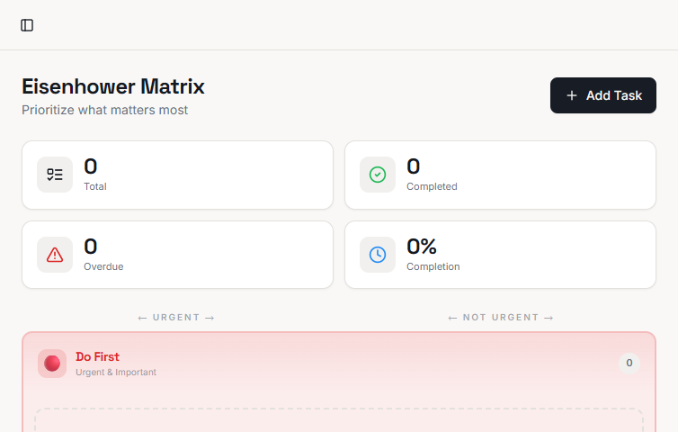
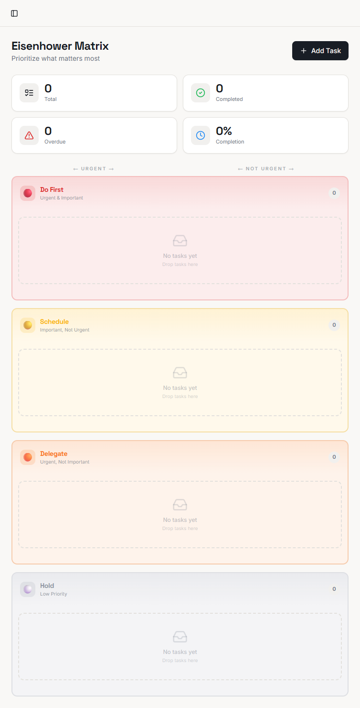
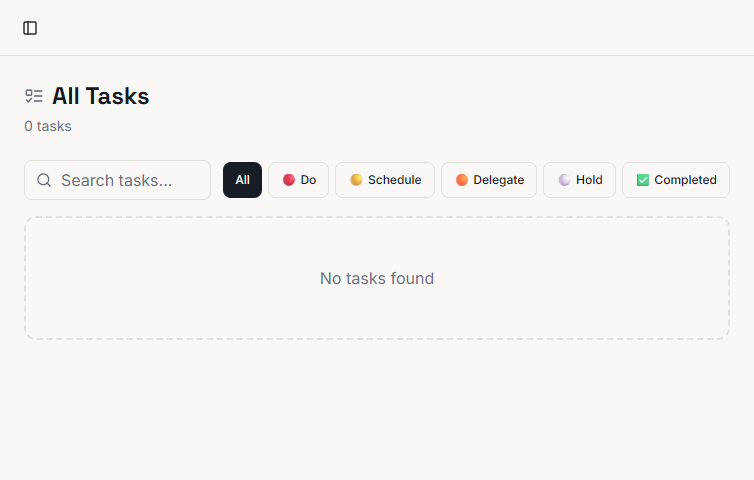
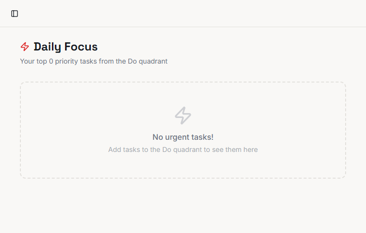
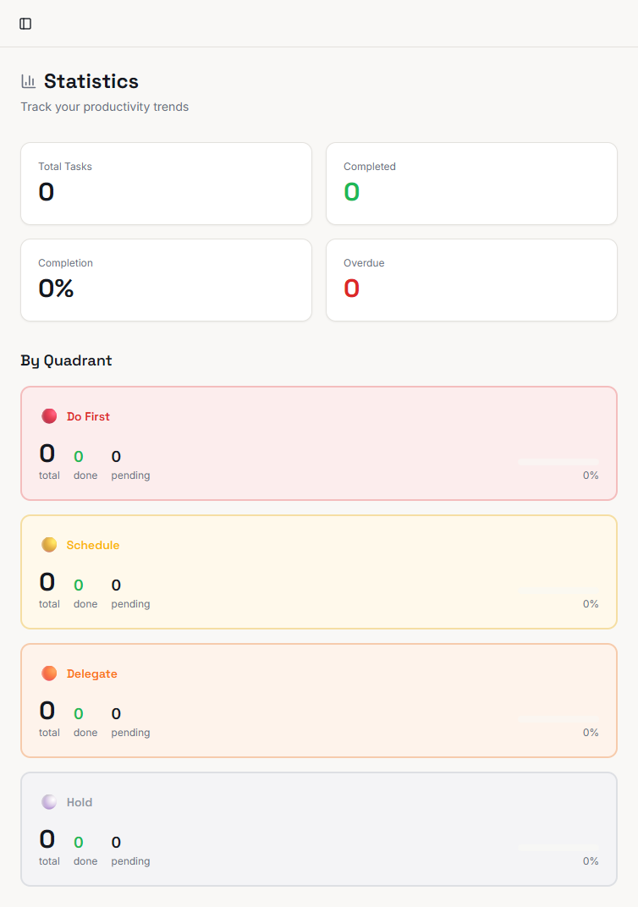
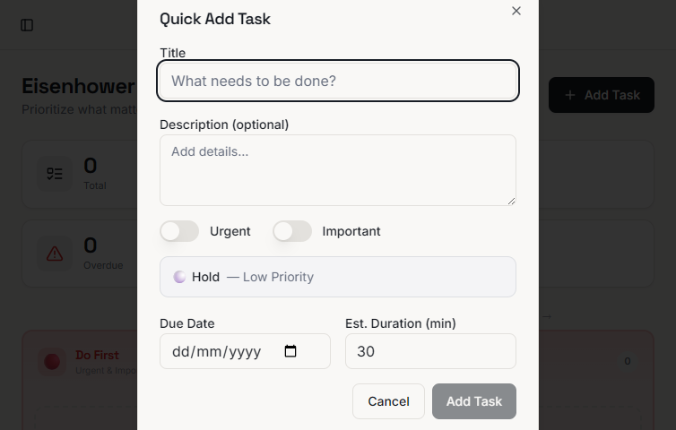
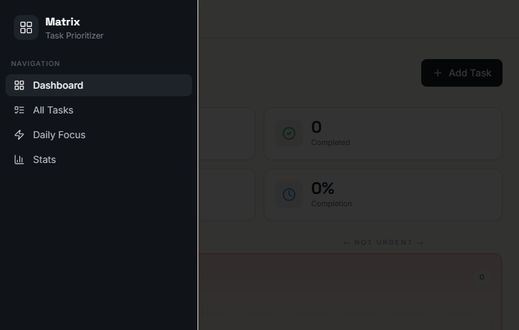

# Eisenhower Matrix - Quadrant Calm

A productivity web app for prioritizing tasks using the Eisenhower Matrix.

The app helps you:
- Organize tasks into `Do`, `Schedule`, `Delegate`, and `Hold`
- Manage task details (status, due date, estimate, tags)
- Focus with a Daily Focus view, time budget summary, and Pomodoro timer
- Track progress with statistics and charts
- Export/import task data
- Use global keyboard shortcuts for faster navigation

## Screenshots

<details>
  <summary>Click to view screenshots</summary>

  
  
  
  
  
  
  
</details>

## Tech Stack

- React + TypeScript
- Vite
- Tailwind CSS
- shadcn/ui (Radix primitives)
- React Router
- dnd-kit (drag and drop)
- Recharts (stats visualizations)
- Supabase Auth
- Vitest + Testing Library

## Getting Started

### 1. Install dependencies

```sh
npm install
```

### 2. Configure environment variables

Create `.env.local` in the project root:

```env
VITE_SUPABASE_URL=https://your-project.supabase.co
VITE_SUPABASE_ANON_KEY=your-anon-key
```

If these values are missing, the app will still build but authentication will not function correctly.

### 3. Run the app

```sh
npm run dev
```

Open the local URL shown by Vite (usually `http://localhost:5173`).

## Available Scripts

- `npm run dev` - Start local development server
- `npm run build` - Production build
- `npm run build:dev` - Development-mode build
- `npm run preview` - Preview built app
- `npm run lint` - Run ESLint
- `npm run test` - Run tests once
- `npm run test:watch` - Run tests in watch mode
- `npx tsc --noEmit` - Type-check project

## Core Features

- Matrix dashboard with drag-and-drop task movement between quadrants
- Quick Add and Edit modals
- Task tags/labels with color coding and filtering
- Task list with search, quadrant filters, and tag filter
- Daily Focus page:
  - Cross-quadrant urgency ranking
  - Configurable focus count (`Top 3/5/8/10`)
  - Time budget summary
  - Pomodoro timer (`25/5` focus-break cycle)
- Stats page with chart-based task insights
- Settings page with data export/import and clear actions
- Keyboard shortcuts and shortcut help dialog

## Keyboard Shortcuts

- `Ctrl/Cmd + N` - Open Quick Add
- `Ctrl/Cmd + /` - Open shortcuts dialog
- `1` - Dashboard
- `2` - All Tasks
- `3` - Daily Focus
- `4` - Stats
- `F` - Toggle focus query mode (when supported by current route)

Shortcuts are disabled while typing in inputs, textareas, selects, or contenteditable elements.

## Project Structure

```text
src/
  components/      UI and feature components
  context/         React context providers (tasks, auth)
  hooks/           Custom hooks (tasks, keyboard shortcuts, etc.)
  pages/           Route-level pages
  test/            Unit tests
  types/           Shared domain types
```

## Notes

- Task state is persisted locally for app behavior and supports export/import workflows.
- Authentication uses Supabase and route protection is applied for main app pages.
- Monitoring and diagnostics components are enabled in development mode.
